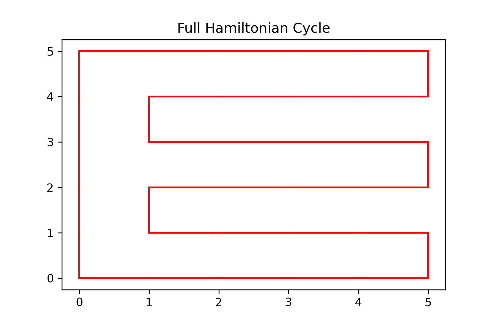
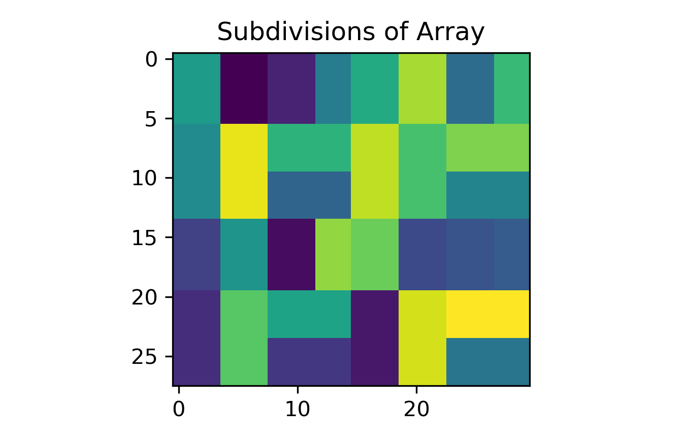
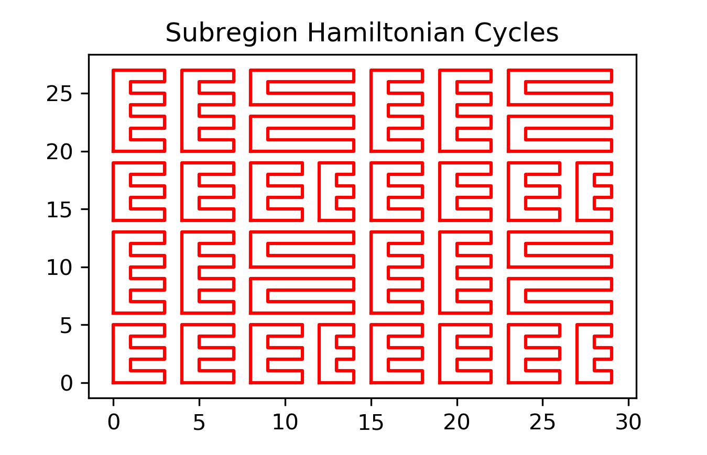
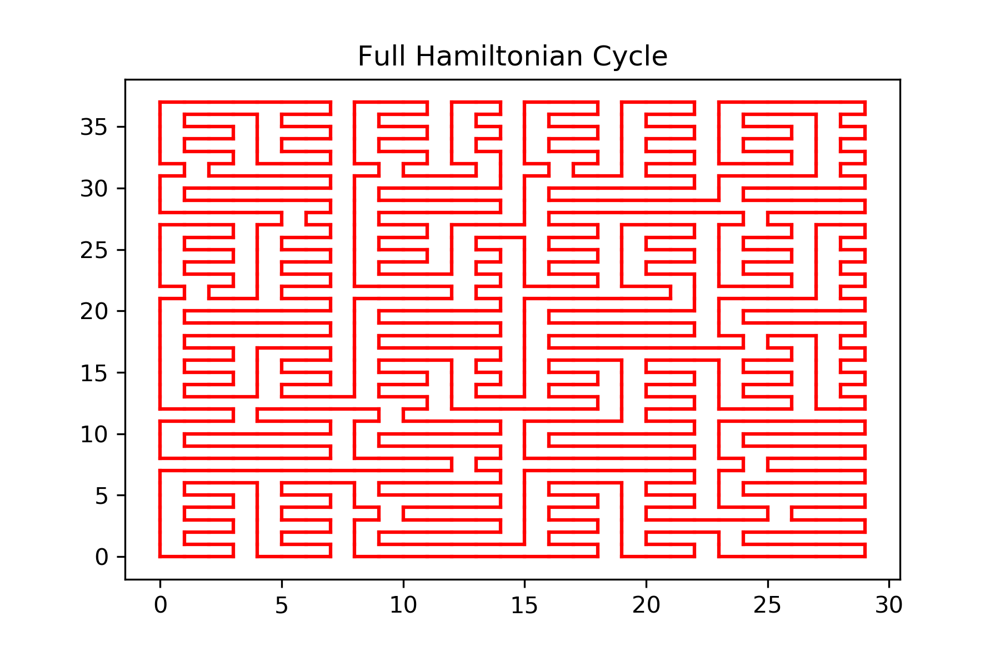
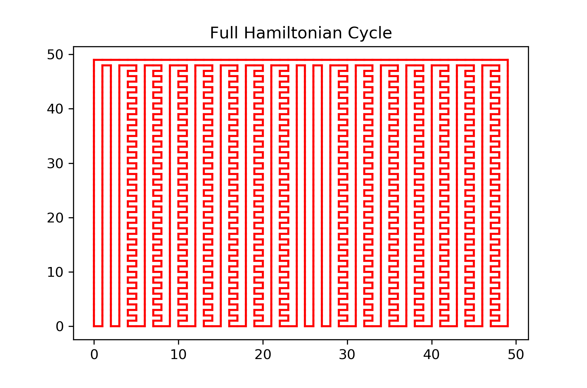

# perfect-snake-challenge
Bot plays a perfect game of snake by following a Hamiltonian Cycle and taking shortcuts when it is safe to do so.

Methods used to solve perfect snake: Memoization, Divide and Conquer, Union Find, Hamiltonian Cycles, Sliding Window, Backtracking 

More details in [the how it was made section](#how-it-was-made).

# usage

1. Adjust settings.py as desired.

<details>

<summary>Click to show default settings.</summary>

```python
settings = {
            # =============================================================================
            # WINDOW SETTINGS
            # =============================================================================
            "WIDTH": None,               # window width (pixels) if None will be calculated from pixels per column
            "HEIGHT": 1200,              # window height
            "BOX_WIDTH": 30,             # iff "WIDTH" is None then each row and column will be "BOX_WIDTH" pixels wide
            
            # =============================================================================
            # GRID SETTINGS
            # =============================================================================
            "C": 40,                         # 4 <= number of columns <= 400 and C must be even
            "R": 40,                         # 4 <= number of rows <= 400 and R must be even
            "GRID_COLOR": (150, 150, 150),
            "GRID_THICKNESS": 1,
            "SHOW_GRID": False,              # Turn grid on / off
            "UPDATE_BACKGROUND": False,      # Switches true for one frame when grid or hamcycle changes
            
            # =============================================================================
            # GAME SPEED SETTINGS
            # =============================================================================
            "SLEEP_TIME": 0.02,          # sleep between iterations to reduce the frame rate
            "LOCK_TIME": 0.2,            # delay between allowed input actions (seconds)
            
            # =============================================================================
            # HAMILTONIAN CYCLE SETTINGS            
            # =============================================================================
            "SHUFFLE": True,              # shuffle the kernel windows before merging sybcycles (True = more random grid)
            "MAX_SIZE": 6,                # 6 <= MAX_SIZE <= 36 the maximum window size for the subdivided array
            "HAM_COLOR": (100, 200, 100), # color of the ham path
            "HAM_WIDTH": 1,               # width of the hamiltonian cycle path
            "SHOW_PATH": True,
            "SHORTCUTS": True,    # Allows snake to leave the path if it is safe and efficient to do so

            # =============================================================================
            # SNAKE AND FOOD SETTINGS
            # =============================================================================
            "SNAKE_WIDTH": 0.8,           # fraction of min(col_width, row_height)
            "SNAKE_COLOR": (0, 100, 0), 
            "CENTER_SNAKE": False,        # start with snake in center of map
            "SNAKE_LENGTH": 10,           # the start length of the snake
            "FOOD_COLOR": (175, 0, 0),
            }
```

</details>

2. Run perfect_snake_game.py
3. Enjoy!


# controls

<b>escape key</b>: quit game<br>
<b>up / down arrow keys</b>: speed up / slow down game speed<br>
<b>g</b>: show / hide grid<br>
<b>h</b>: show / hide Hamiltonian cycle<br>
<b>s</b>: on / off shortcuts (when off the snake will strictly follow the Hamiltonian cycle)<br>

# How-it-was-made

The process of making a perfect snake can be broken down into several sub-problems.

Click on each item below to see visual aids and the subproblem's solution.  


<details>

<summary>1. Calculate a Hamiltonian Cycle for a small array (8 by 8 or less)</summary>
<br>

HamCycle.ham_cycle.helper uses backtracking to find a path that visits every node once and ends adjacent to the start node.
This approach is limited to array sizes of (8 by 6) or smaller.  
Keep in mind that any array of dimenions (R, C) where R and C are both odd with not have a Hamiltonian Cycle.


<hr>

</details>

<details>

<summary>2. Subdivide a large array into small subarrays of <b>max_size</b> where every subarray contains an even number of nodes.</summary>
<br>

Because the Hamiltonian Cycle solution does not scale well, we cannot use it to find a cycle for an array of size say (20 by 20) and definitely not for an array of size (400 by 400).

We can however, use a divide and conquer approach to break down the large array into manageable subarrays.


<hr>

</details>

<details>

<summary>3. Calculate the Hamiltonian Cycle for every subarray.  We will call these sub-cycles.</summary>
<br>

<b>Memoization Optimization</b>: For subarray (y1, x1, y2, x2) solve for the subarray (0, 0, y2 - y1, x2 - x1) and then shift the resulting cycle by y1, x1.  This may seem counter productive, but by doing this to every cycle we solve for, we can memoize the results so as long as two subarrays are the same shape, they will have the same solution thus greatly decreasing the number of subarrays that we need to find Hamiltonian Cycles for. 


<hr>

</details>

<details>

<summary>4. Connect the subcycles to form one large Hamiltonian Cycle that spans the entire array.</summary>
<br>

```html5
Any two adjacent subcycles can be connected into a larger subcycle if they share two adjacent edges.
          _____               _____
         |_____|             |_  __|
          _____    becomes    _||__ 
         |_____|             |_____|
This process can be applied randomly across the image until all cycles are connected as one.
```

To do so we first put all of the edges into a <b>union-find</b> data structure, where each cycle is it's own group of edges.  

Then we create windows, (called a kernel in the code), of size 2 by 2. The kernel is either | | or <ins>&oline;&oline;</ins>. 

A window is created for every possible 2 by 2 region on the array.  

If the two parallel edges both align with an edge in the subcycles and each edge belongs to a different subycle then switch the edges from | | to <ins>&oline;&oline;</ins> or vice versa.  

After doing so, update the union-find data structure by removing the old edges, adding the new edges, and ensuring that the two formerly separate subcycles are merged into one larger subcycle.

Repeat this process until only one subcycle remains.  

<b>Note:</b> We can add variety (apparent randomness) to the resulting Hamiltonian Cycle by shuffling the kernels first so that subcycles are merged at different locations and in different orders every time.  Using a smaller max subarray size also increases the apparent randomness of the resulting structure.  

<u><b>Random and Structured Full Hamiltonian Cycle</b></u>



<hr>

</details>

<details>

<summary>5. Convert the edges of the Hamiltonian Cycle into a directed graph for the snake to follow.</summary>
<br>

After merging all subcycles into a single cycle the edges are non-sequentially stored in a union-find data structure.

To convert the list of edges into a directed graph we first convert them into an undirected graph where each node has two neighbors. i.e: graph[(i, j)] -> [(i1, j1), (i2, j2)]

Then we pick a start location (0, 0) and randomly choose what direction the graph goes by randomly picking (0, 1) or (1, 0) as the child of (0, 0)

(0, 0) is now the parent node and (1, 0) is the child node.  Repeat this process and never choose the parent node as the next node.  

When we return to (0, 0) the directed graph is complete.  
<hr>

</details>

<details>

<summary>6. Create the game of snake</summary>
<br>

Have a Game class, Snake class, and HamCycle class.  
Upon initializing the game:
1. spawn the snake (at least of length 2)
2. spawn food
3. solve the Hamiltonian Cycle of the grid
4. create pygame surfaces for the grid, Hamiltonian Cycle, and a blank surface (for clearing screen when grid and Hamiltonian Cycle are hidden)

Notes on Snake class:
1. Use a double ended queue (deque) to store the snake's body.  This allows for O(1) updates to the snake's position (pop from the tail and append to the head).
2. Handle food spawning in the snake class.  Food spawning is similar to snake spawning and the snake interacts with the food, it's just easier this way.  
3. Store the Hamiltonian Cycle the snake must follow as a directed graph that is an attribute of the snake (Snake.graph).  
4. Whenever food is spawned, update the cost of each location.  The cost is the distance from the position (i, j) to the food assuming the snake strictly follows the Hamiltonian Path.  This is necessary for identifying shortcuts.  
5. Snake.step moves the snake one frame into the future and handles eating food.  It is here that the snake grows in length by skipping popping from the tail.  It is also here that the snake considers whether or not to take a short cut by calling Snake.is_safe whenever a shortcut is considered.  
6. Snake.is_safe sends a hypothetical snake along the shortcut, it assumes that it find's 3 food on the path (a little buffer error) and runs the snake for snake.body.length steps.  If the hypothetical snake does not bite it's own tail in this time then the shortcut is deemed safe and the snake follows it.  Otherwise, the snake continues to follow the tried and true Hamiltonian Cycle.

Notes on Game class:
1. While the array may only be say 50 by 50 in size, the actual display is much larger say 800 by 800 (depending on the settings).  i.e: If we want to draw an apple at location (1, 1) and the grid is (10 by 10) but the window is (100 by 100) we would actually need to draw the apple centered at (15, 15).  Apple at (8, 5) -> (85, 55).  Game.map_to_grid handles this transformation when drawing the snake and apple.
2. Game.game_events handles quitting the game by x and reading in the keyboard input.  These events are then handled in a series of if / elif statements in the Game.run while-loop.
3. Also handled in the while loop is a call to Snake.step which progresses the snake forward one step in time.  
4. At the end of every while-loop iteration, Game.draw is called to blit the current game state to the screen.  
5. Whenever a keyboard input is handled, a temporary lock is placed on the keyboard that expires after 0.2 seconds.  This prevents users from accidentally pressing a key multiple times in a single press. LOCK_TIME can be adjusted in settings.py.

Last but not least notes on settings: more notes in the settings.py file
1. All default settings are stored in a dictionary in settings.py which is imported and then unpacked as keyword input to the Game class.  
2. Number of rows (R) and number of columns (C) must be even.  <b>This is because rectangular subarrays with an odd number of elements cannot have a Hamiltonian Cycle.</b> By setting R and C to even numbers the HamCycle.subdivide process can ensure that all subarrays have an even number of elements.
3. You can either set the window WIDTH and HEIGHT in pixels <b>or</b> set the BOX_WIDTH in pixels.  If you set WIDTH to None and choose a BOX_WIDTH then the size of the window will adjust to fit the row and column input values.  BOX_WIDTH is recommended as it avoids skewing of the grid when R &neq; C.
4. The game speed can be adjusted in game, but you can also choose a default game speed by adjusting SLEEP_TIME
5. Using a small MAX_SIZE (6) and SHUFFLE turned on makes the Hamiltonian Cycle appear more random while a large MAX_SIZE (40) and SHUFFLE off makes the Hamiltonian Cycle appear very orderly
6. SHORTCUTS are changeable by tapping s key in game, when True it allows the snake to take shortcuts and when False the snake must strictly follow the Hamiltonian Cycle.
7. SHOW_PATH toggles the Hamiltonian Cycle visibility on and off, can be changed in game with the h key.


</details>

<details>

<summary>7. Detect shortcuts to the food and determine when it is safe to take a shortcut.</summary>
<br>

Calculate the <b>cost</b> to reach the food from every position on the snake's path.  Where the cost[(i, j)] is the number of steps the snake must take to reach the food if it strictly follows the Hamiltonian Cycle.

Then at each step, consider all four neighboring spaces to the snake's head (up, down, left, right).  

Aside: Yes this includes backwards, but that will never be selected because it will never cost less than moving forwards.

Choose the direction that has the lowest cost to reach the food and then check if it is a safe path.

If the best direction follows the Hamiltonian Cycle, then is safe.

If it does not follow the Hamiltonian Cycle, then send out a hypothetical snake to take one step in the chosen direction and then follow the Hamiltonian Cycle for SNAKE.body.length + hypothetical_food steps.  If the hypothetical snake does not bite it's own tail then the direction is safe.  Here hypothetical_food is set to 5 meaning we expect the snake to at most find 5 food on this path.  This is important because the tail does not move when the snake finds food.  This parameter is not accessible in settings.py, it is found in Snake.is_safe and can be increased to perhaps 10 if you wish to be extremely cautious.  I would recommend keeping it at least 3 though to avoid mistakes near the end-game.

</details>

<details>

<summary>8. Make the snake sentient</summary>
<br>

{snake_out.gif}

</details>


